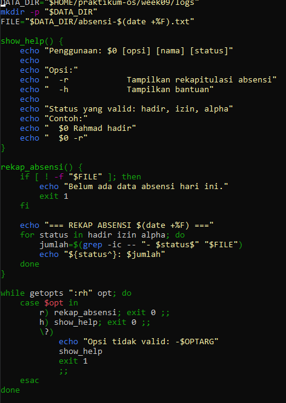
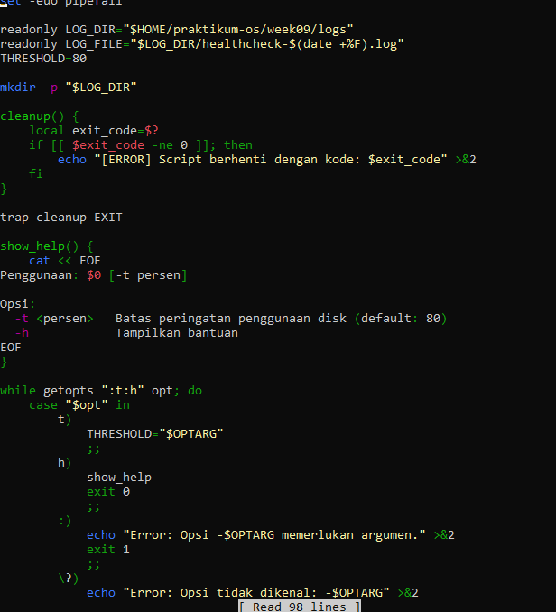

<h1 align = "center">Jobsheet 9 - Sistem Operasi </h1>

```
Nama        :Lindhu Nuril Rahmatdanto
NIM         :254107020216
Kelas       :TI 1G  
No Absen    :17
```

## Tugas 1 Script Absensi Kelas

1. Buat script absensi.sh yang:
• Menerima argumen nama mahasiswa dan status (hadir/izin/alpha)

• Menyimpan entri ke absensi-YYYY-MM-DD.txt dengan format [HH:MM]
NAMA - STATUS
• Opsi -r: tampilkan rekapitulasi (jumlah per status)
• Opsi -h: tampilkan bantuan



2. Rekam minimal 5 entri dan tampilkan rekapitulasinya.
Konsep wajib: variabel, parameter posisional, getopts, if, for, fungsi, dan redirection ke file.


## Tugas 2 Script Health Check Sistem

Konteks: administrator membuat pemeriksaan kondisi server sebelum maintenance.
Instruksi:
1. Buat script healthcheck.sh menggunakan template profesional dari bagian
Best Practices.
2. Script menampilkan: tanggal/waktu, hostname, uptime, penggunaan CPU,
memori, dan disk untuk setiap filesystem yang terpasang.
3. Jika penggunaan disk mana pun melebihi 80%, tampilkan peringatan.
4. Simpan hasil ke healthcheck-YYYY-MM-DD.log dan tampilkan ke terminal
sekaligus menggunakan tee.
5. Opsi -t <persen> mengubah batas peringatan disk (default 80).
Konsep wajib: set -euo pipefail, trap, getopts, fungsi dengan local,
for, if, dan tee




