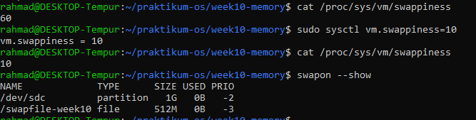
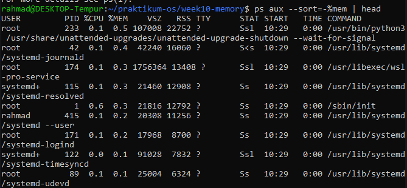
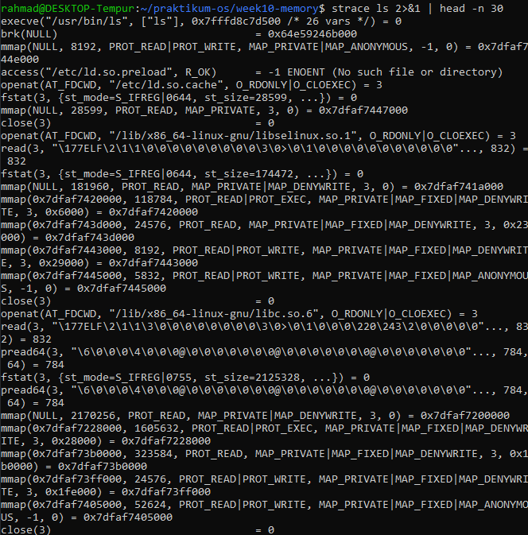
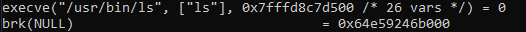
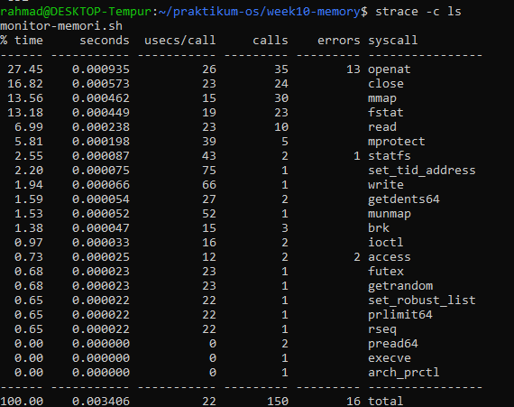
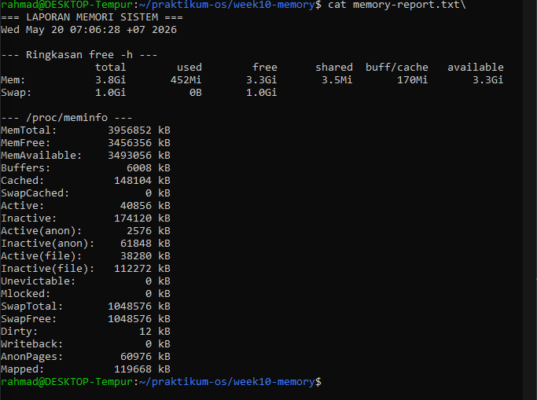
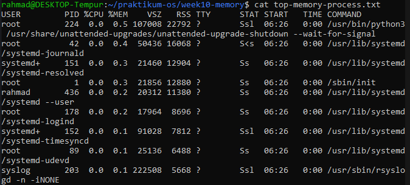
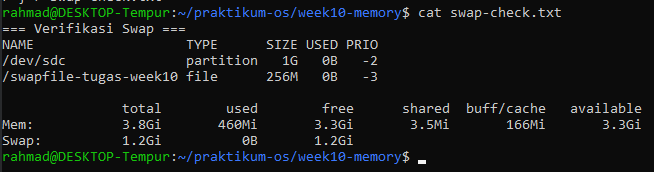
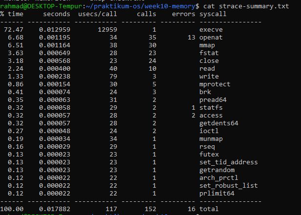
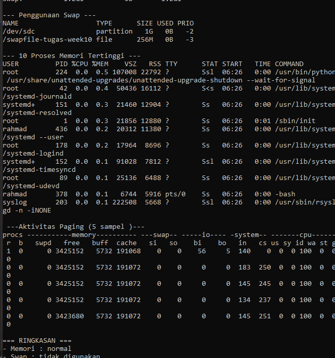

<h1 align = "center">Jobsheet 10 - Sistem Operasi </h1>

```
Nama        :Lindhu Nuril Rahmatdanto
NIM         :254107020216
Kelas       :TI 1G  
No Absen    :17
```
## Praktikum 10.3

Analisis:

1. Berapa nilai swappiness default? Apa artinya bagi perilaku kernel dalam menggunakan swap?
Nilai swappiness default adalah 60
2. Setelah diubah ke 10, konfirmasi nilai berubah pada output cat kedua. Apa dampak nilai 10 terhadap penggunaan swap dibanding nilai 60?
Dampak yang terasa setelah swap bernilai 10 adalah penggunaan swapnya menjadi lebih sedikit dan sistem terasa lebih cepat dan responsif
3. Apakah entri /swapfile-week10 muncul di swapon –show? Jika tidak, pastikan Langkah 2 (chmod 600) sudah dijalankan sebelum Langkah 3.


## Praktikum 10.4

Analisis:
1. Proses apa yang berada di urutan pertama? Catat nilai %MEM dan RSS-nya.
Nilai %MEM : 0.5
Nilai RSS  : 22752

2. Konversikan RSS dari KB ke MB (bagi 1024). Misalnya, RSS=524288 berarti proses menggunakan 512 MB RAM. Apakah wajar untuk jenis program tersebut?
Untuk jenis program ini disebut wajar karena memakan ram yang relatif keci yaitu 22.2 mb ram
3. Mengapa VSZ selalu lebih besar dari RSS pada proses yang sama?
Karena VSZ sejatinya hanya meminta space untuk berjaga-jaga(bukan berarti langsung terpakai),sedangkan RAM meminta space untuk dipakai.
4. Apakah urutan proses di ps konsisten dengan tampilan top saat diurutkan berdasarkan %MEM?
Tidak selalu,karena top bersifat real-time ( yang berarti diupdate terus menerus) sedangkan ps aux hanya mengambil snapshot di satu waktu yang diminta saja

## Praktikum 10.5

Analisis:
1. Variabel THRESHOLD=20 menetapkan batas persentase. Perintah free | awk ’/Mem/ {printf "%d", $7/$2*100}’ mengambil kolom ke-7 (available) dibagi kolom ke-2 (total) dari baris Mem, lalu dikalikan 100 untuk menghasilkan
persentase bilangan bulat.
2. Kondisi if [ "$AVAIL" -lt "$THRESHOLD" ] bernilai benar jika persentase memori tersedia di bawah 20.
3. Ubah THRESHOLD menjadi 90 dan jalankan ulang. Apa yang berubah pada output? Mengapa demikian?
Akan muncul warning karena threshold lebih besar daripada ram yang available

## Praktikum 10.6

Analisis:
1. Dari output Langkah 1, identifikasi minimal 4 system call berbeda. Jelaskan fungsi singkat masing-masing berdasarkan argumen yang terlihat.

Saya mengalami suatu kondisi dimana saya tidak bisa mengidentifikasi isi dari syscall dan nilai kembalinya dikarenakan kesulitan membaca akibat kode yang tidak beraturan.Bagaimanapun juga saya tetap berusaha untuk membaca kode itu

menurut paham saya syscall ini bernama execve dengan argumen ("/usr/bin/ls", ["ls"], 0x7fffd8c7d500 /* 26 vars */) dan nilai kembali adalah = 0
2. Dari ringkasan strace -c, system call mana yang paling sering dipanggil? Mengapa?

Dari screenshot ini disimpulkan bahwa syscall yang paling banyak dipanggil adalah openat dengan usecs sebanyak 35.Ini terjadi karena openat dipakai setiap kali program ingin membuka sesuatu seperti file,library,direktory dll
3. Apakah ada system call dengan errors lebih dari 0? Apakah itu berarti program bermasalah, ataukah bagian normal dari logika program?
Dalam hal ini,misal saya mengambil openat dengan jumlah error 13.Ini terjadi karena ketika program ingin membuka program sering ditemukan bahwa config,locale ataupun cachenya tidak ada.
4. Apakah jumlah system call berbeda antara ls dan ls /etc? Faktor apa yang menyebabkan perbedaan tersebut?
Ya,jumlah yang berbeda ini dipengaruhi oleh seberapa spesifik benda itu dicari,contoh untuk ls ia akan membaca direktori saat ini sedangkan etc harus memproses pathnya,direktorinya dan membaca isi direktori tersebut.

## Tugas 10.1

Analisis:
1. Hitung persentase memori tersedia (available / total × 100%). Apakah sistem dalam kondisi normal?

Setelah di kalkulasi dari rumus tersebut ditemukan bahwa 3.8 * 3.3 di kali 100 % adalah 1.15151515152 atau 1.15% persen dari ram total,yang mana ini adalah hal yang normal
2. Mengapa buff/cache tidak dihitung sebagai memori yang terpakai dari sudut pandang ketersediaan untuk aplikasi?
Karena buff / cache bernilai reclaimable,yang berarti bisa di claim kembali apabila membtuhkan
3. Dari /proc/meminfo, apakah SwapTotal lebih besar dari 0? Berapa nilai SwapFree?
Ya SwapTotal dan Swapfree bernilai lebih dari 0 dan bernilai sama yaitu 1048576.

## Tugas 10.2

Analisis:
1. Proses apa di urutan pertama? Catat nilai %MEM dan RSS.

Nilai %MEM dan RSS pada root adalah 0.5 dan 22792
2. Konversikan RSS ke MB (bagi 1024). Apakah wajar?
Ya,sangat wajar apabila proses root memakan Ram sebesar 22 mb.Karena root hanya untuk proses yang punya privilege administratif dan bkan indikator konsumsi resource
3. Jumlahkan %MEM dari 5 proses teratas. Berapa persen RAM yang mereka gunakan bersama?
Berdasarkan screenshot yang ada,terdapat 0.5, 0.4, 0.3, 0.3, 0.2 pada kolom 5 teratas.Hasil yang didapat pada penjumlahan ini adalah 1.7%. 

## Tugas 10.3

Analisis:
1. Identifikasi kolom NAME, TYPE, SIZE, dan USED pada output swapon –show.

2. Apakah nilai total pada baris Swap di free -h bertambah 256 MB?
Ya,pada awalnya hanya terdapat 1.0 Gi pada baris swap,sekarang terdapat 1.2 Gi pada baris swap
3. Mengapa permission 600 penting? Apa risiko jika diatur ke 644?
Penting karena mnghindari suatu file bisa dibaca oleh orang lain.Apabila diatur ke 644 maka pihak ketiga bisa membacanya

## Tugas 10.4

Analisis:
1. Sebutkan minimal 5 system call dari strace-summary.txt beserta fungsi singkatnya.

Ada execve,openat,nmap,fstat dan close.Execve berfungsi untuk menjalankan program baru,openat untuk membuka file atau direktori,nmap untuk memetakan file atau memory ke virtual adress proses,fstat untuk mengambil metadata file yang sudah dibuka dan close untuk menutup file descriptor.
2. System call mana yang paling sering dipanggil? Mengapa?
System openat paling sering dipanggil karena berfungsi untuk membuka file,direktori dll
3. Apakah ada errors lebih dari 0? Apakah program tetap berjalan normal meskipun ada kegagalan tersebut?
System seperti openat mengalami error sebanyak 13 kali dan tetap berfungsi normal tanpa adanya gangguan

## Tugas 10.5

Analsis:
1. Jelaskan peran masing-masing fungsi: cek_memori, cek_swap, cek_proses,cek_paging, dan ringkasan. Mengapa diagnosa dipecah menjadi fungsi terpisah?
Karena masing-masing memiliki fungsi yang berbeda dan menyajikan data yang berbedanya juga
2. Berdasarkan bagian RINGKASAN, apakah kondisi sistem normal atau kritis? Jelaskan berdasarkan nilai threshold yang digunakan script.

Menurut ringkasan yang ada sistem ada di kondisi normal karena ram yang digunakan tidak lebih dari 70
3. Mengapa script menggunakan tee "$LAPORAN" bukan redirection biasa > "$LAPORAN"? Apa keuntungannya?
Keuntungannya adalah command tee bisa menampilkan isi file dan menyimpannya ke direktori yang sudah diarahkan sedangkan >> hanya menyimpan
4. Dari output cek_paging, apakah ada aktivitas si atau so? Jika ada, apa implikasinya terhadap performa server?
Ya,terdapat aktivitas si dan so yang bernilai 0,implifikasinya terhadap server sangat baik tergantung pada besarnya nilai tersebut,semakin kecil nilai tersebut maka semakin baik karena apa bila si atau so nya tinggi maka dikhawatirkan sistem mengalami memory pressure 
